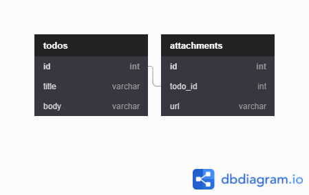

WPF Application using Entity Framework
===

Step to use
---

1. Install SQL Server Express
2. Create 2 table using this design  

3. Change `ConnectionURL` on [Tugas6/Model/ApplicationDbContext.cs](./Tugas6/Model/ApplicationDbContext.cs) with your Connection string